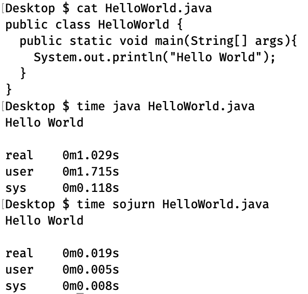

# Sojurn
Run Java faster with a local app server.



## Installation
* Mac: `brew install augustnagro/tools/sojurn`

## Requirements
* Mac or Linux, until Graal's Substrate VM adds Windows Support
* Java 11+ JDK (can be built for lower version)

## Usage
```text
sojurn <options> filename.[jar | java]

Available options:
--port <number>  Connect to the server at the given port. Default is 8081.
--stop           Stops the server, if running.

Note: The client will attempt to start a server instance
if one isn't running at the provided or default port.
This requires the server jar be placed in the user's home
directory, or be installed via package manager
```

## Architecture
Sojurn operates using the client-server model. The client feeds requests to a long-running virtual machine over sockets, saving the need to initialize a new VM on each run.

This project is similar in scope to [Nailgun](https://github.com/facebook/nailgun), but works with Java 9+ and is dramatically simplified. The client is written entirely in Java and compiled to native using [Graal](https://www.graalvm.org/). Whereas Nailgun uses esoteric and platform-dependent protocols, Sojurn sticks to sockets. A HelloWorld example is ~10ms faster with Nailgun, but this advantage disappears in larger projects because of Nailgun's SecurityManager.

## Building Client Executable
* Compile Client with java 1.8
* Install Graal
* Run `native-image -H:Name=sojurn -jar client.jar`

## TODO
* Build for Linux & deploy to other package managers
* Consider Nailgun client-server protocols:
    * Named pipes on windows (see Nailgun)
    * JNI native sockets on Unix (see Nailgun, project Panama)
    * Memory-mapped file
* Testing
